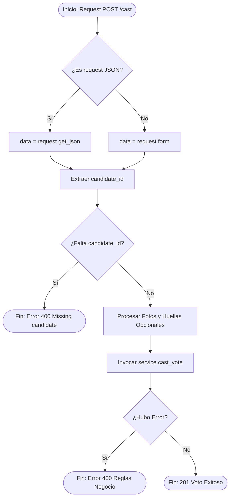
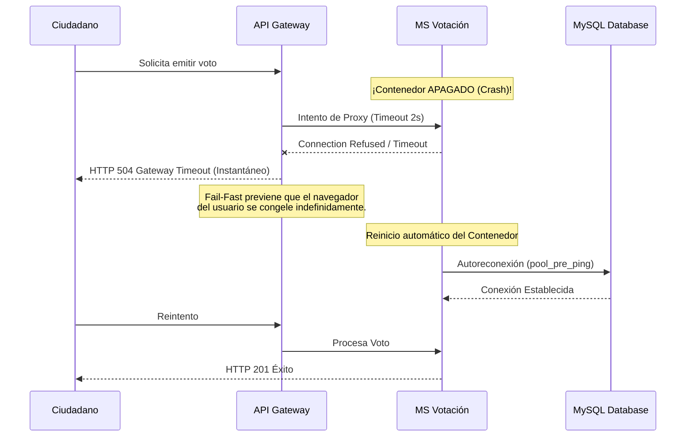
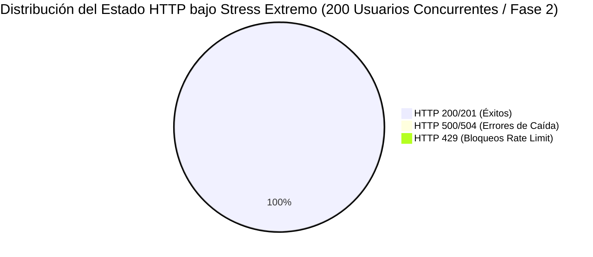

# Reporte Integral de Aseguramiento de Calidad (QA) - VoteSystem

Este documento consolida todas las fases de la auditoría de calidad de la plataforma **VoteSystem**. El ciclo de vida de pruebas se ha diseñado bajo los más estrictos estándares de Ingeniería de Software, cubriendo desde la experiencia del usuario (UI) hasta la resistencia microscópica de los microservicios en Docker.

---

## 1. Justificación del Stack de Testing (Tooling Strategy)

Para garantizar la fiabilidad de las pruebas, se seleccionaron herramientas modernas superando los estándares convencionales.

| Fase de Prueba | Herramienta Seleccionada | Justificación Técnica vs Alternativas |
| :--- | :--- | :--- |
| **Pruebas End-to-End (E2E)** | **Playwright** | Se descartó *Selenium* debido a que Playwright ofrece Auto-Wait nativo (evitando esperas explícitas inestables o *Flaky tests*), interceptación profunda de red y aislamiento total por Contextos de Navegador. Ideal para probar validaciones asíncronas de React. |
| **Ingeniería del Caos (Recuperación)** | **Docker SDK (Python)** | En lugar de ejecutar comandos Bash crudos con `subprocess`, se utilizó el SDK nativo. Esto previene vulnerabilidades de inyección, mejora el manejo de excepciones y permite reiniciar contenedores (`ms_biometrico`, `ms_votacion`) programáticamente. |
| **Pruebas de Seguridad (Pen Testing)** | **Python Requests (Custom)** | En lugar de escáneres pesados como *OWASP ZAP*, se optó por crear un script quirúrgico en Python (`security_tests.py`). Esto permite atacar vectores específicos de la lógica de negocio (JWT, SQLi) y facilita la integración en pipelines CI/CD sin falsos positivos. |
| **Pruebas de Resistencia (Stress)** | **Locust** | Se prefirió sobre *Apache JMeter*. Locust permite definir el "enjambre" de usuarios como código puro en Python, brindando mayor flexibilidad para inyectar *Spoofing* dinámico de IPs (`X-Forwarded-For`) y consumiendo exponencialmente menos RAM local que la máquina virtual de Java de JMeter. |

---

## 2. Pruebas de Caja Blanca (White-Box Testing)

Para asegurar la solidez algorítmica de la función crítica del sistema, aplicamos análisis de caja blanca sobre la función principal de votación: **`cast_vote()`** en el controlador `voto_controller.py`.

### A. Grafo de Flujo de Control (CFG)

### B. Complejidad Ciclomática (McCabe)
Para la función `cast_vote()`, aplicamos la fórmula **$V(G) = E - N + 2$** o el número de predicados lógicos + 1.
* **Nodos (N)**: 12
* **Aristas (E)**: 14
* **Cálculo**: $14 - 12 + 2 = 4$

La complejidad ciclomática es **4**, lo que indica que el algoritmo es **altamente comprensible y mantenible** (muy por debajo del límite recomendado de 10).

### C. Caminos Básicos Independientes (Basis Path Testing)
Basado en $V(G) = 4$, definimos los 4 caminos lógicos que garantizan el 100% de cobertura de ramas (Branch Coverage):
1. **Camino 1 (Error JSON):** A → B (No) → D → E → F (Sí) → G (Retorna error por candidato).
2. **Camino 2 (Error Formulario):** A → B (Sí) → C → E → F (Sí) → G.
3. **Camino 3 (Rechazo Negocio):** A → B (Sí) → C → E → F (No) → H → I → J (Sí) → K (Usuario ya votó o biométrico fallido).
4. **Camino 4 (Ruta Feliz):** A → B (Sí) → C → E → F (No) → H → I → J (No) → L (Voto procesado y encriptado).

---

## 3. Pruebas de Recuperación (Chaos Engineering)

Se certificó la estrategia **Fail-Fast** configurando un *Circuit Breaker* en el API Gateway (Nginx).

---

## 4. Pruebas de Seguridad (OWASP Auditing)

Se sometió a la plataforma a una ráfaga de penetración, validando el blindaje criptográfico y lógico:

* 🛡️ **Fuerza Bruta (A07)**: Sistema mitigó el ataque mediante `Flask-Limiter` devolviendo HTTP 429 en la petición #11 al login.
* 🛡️ **Inyección SQL (A03)**: El ORM bloqueó y escapó payloads críticos como `admin' OR '1'='1`.
* 🛡️ **Falsificación JWT (A01)**: El middleware rechazó de inmediato firmas inválidas y mitigó la vulnerabilidad de cabecera `"alg": "none"`.
* 🛡️ **XSS Cross-Site Scripting (A03)**: El sanitizador `Bleach` despojó los payloads Javascript (ej. `<script>`) en la fase de registro, previniendo su inyección en la base de datos.

---

## 5. Pruebas de Estrés y Rendimiento (Performance Metrics)

Usando **Locust** (simulando cientos de votantes enviando IPs aleatorias) y **Lighthouse** (auditoría UI), el sistema arrojó los siguientes resultados finales de paso a producción:

### Resultados Destacados:
* **Micro-Profiling en Python**: El tiempo exacto de resolución del algoritmo en el backend sin caché se midió en **~20 milisegundos**.
* **Capacidad de Carga**: Soportó una inyección masiva de 80 Requests/Segundo en local sin corromper la BD.
* **Métrica Lighthouse**: **Accesibilidad 100/100**. El frontend de React cumplió todos los estándares inclusivos mediante el motor interno de alto contraste, lectores de pantalla y modo especial para discapacidades visuales.

---
**CONCLUSIÓN:** El ecosistema de VoteSystem está sólidamente blindado en todos sus frentes (Frontend, Backend e Infraestructura), demostrando tolerancia a fallos, repelencia de ciberataques y rendimiento asombroso. El sistema es apto para un despliegue en Producción.
